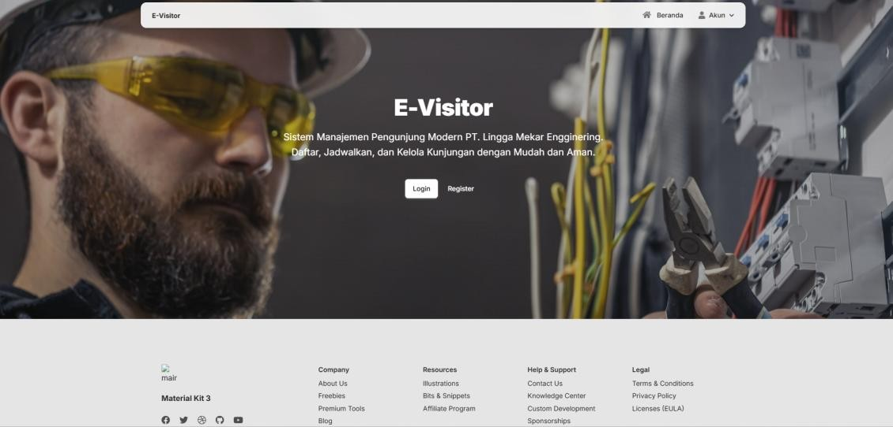
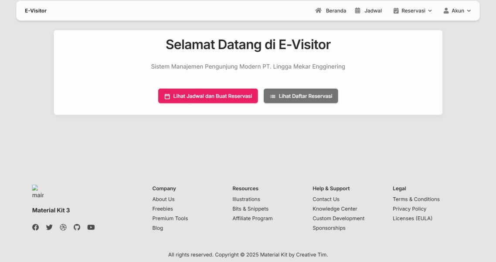
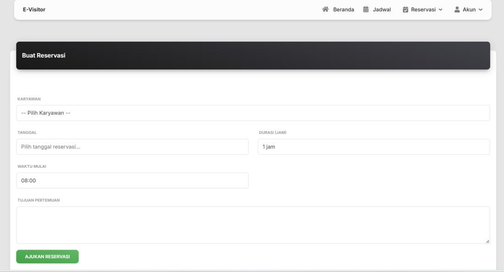
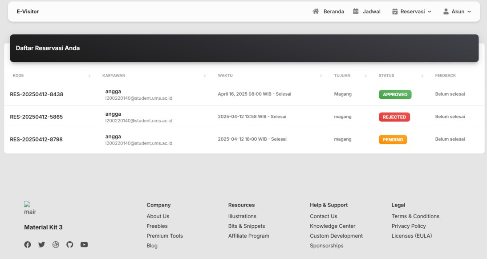
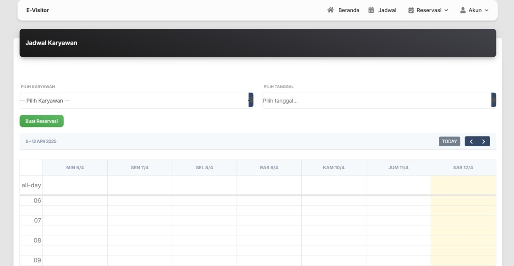
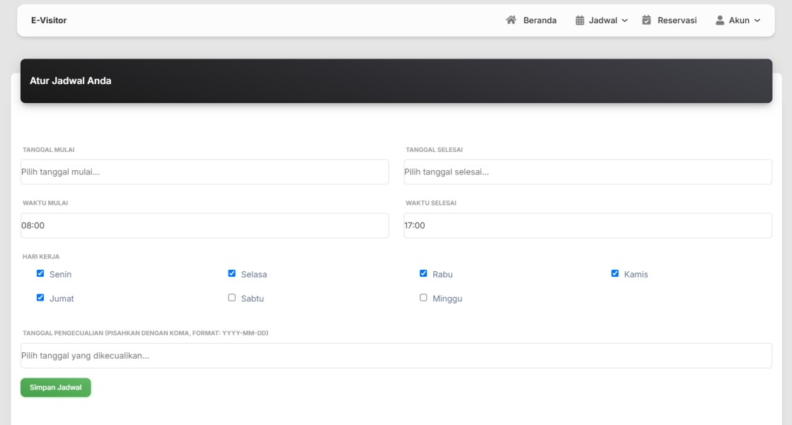

# Panduan Pengaturan Proyek

Selamat datang di proyek ini! Ikuti petunjuk di bawah ini untuk menyiapkan dan menjalankan aplikasi di mesin lokal Anda.

## Prasyarat

Sebelum menjalankan proyek, pastikan Anda telah menginstal hal-hal berikut:

- **PostgreSQL**  
  Instal PostgreSQL dengan mengikuti panduan di sini:  
  [Panduan Instalasi PostgreSQL](https://www.enterprisedb.com/postgresql-tutorial-resources-training-1?uuid=69f95902-b451-4735-b7e4-1b62209d4dfd&campaignId=postgres_rc_17)

## Langkah-Langkah Instalasi

### 1. Instal PostgreSQL

Ikuti instruksi pada link yang disediakan untuk menginstal PostgreSQL di mesin Anda.

### 2. Menyiapkan Virtual Environment

Setelah PostgreSQL terinstal, buka direktori root dari repositori proyek menggunakan terminal atau command prompt. Kemudian, jalankan perintah berikut untuk membuat virtual environment Python:

```bash
python -m venv env
```

### 3. Aktivasi Virtual Environment

Aktifkan virtual environment dengan menjalankan perintah berikut sesuai dengan sistem operasi Anda:

- **Windows:**

  ```bash
  env\Scripts\activate
  ```

- **macOS/Linux:**

  ```bash
  source env/bin/activate
  ```

### 4. Instal Dependensi yang Dibutuhkan

Setelah virtual environment aktif, instal paket Python yang diperlukan dengan menjalankan perintah berikut:

```bash
pip install -r requirements.txt
```

Perintah ini akan menginstal semua dependensi yang diperlukan untuk proyek ini.

### 5. Konfigurasi Pengaturan Database

Selanjutnya, buka file `settings.py` yang terletak di direktori `visitor/visitor/setting.py`.

Cari dictionary `DATABASE` dan sesuaikan dengan konfigurasi PostgreSQL Anda (nama, pengguna, kata sandi, host, dan port). Seharusnya terlihat seperti ini:

```python
DATABASE = {
    'NAME': 'nama_database_anda',
    'USER': 'pengguna_postgres_anda',
    'PASSWORD': 'kata_sandi_postgres_anda',
    'HOST': 'localhost',
    'PORT': '5432',  # port default PostgreSQL
}
```

Pastikan untuk mengganti placeholder dengan kredensial PostgreSQL Anda yang sebenarnya.

### 6. Jalankan Server

Setelah mengkonfigurasi pengaturan database, pastikan Anda telah melakukan migrasi database. Arahkan terminal ke direktori tempat file `manage.py` berada (dalam folder `visitor`) dan jalankan:

```bash
python manage.py makemigrations
python manage.py migrate
```

Kemudian, untuk menjalankan server, jalankan:

```bash
python manage.py runserver
```

Ini akan memulai server pengembangan, dan Anda dapat mengakses aplikasi melalui browser secara lokal di `http://127.0.0.1:8000/`.

---

## Cara Penggunaan

1. **Akses Halaman Utama:** Buka `http://127.0.0.1:8000/` di browser web perangkat Anda untuk mengakses Landing Page.
2. **Melakukan Reservasi:** Pengunjung dapat mengunjungi halaman reservasi untuk mengisi formulir jadwal kunjungan/pertemuan.
3. **Melihat Jadwal:** Aplikasi menyediakan fitur untuk melihat ketersediaan waktu dan jadwal karyawan.
4. **Manajemen Jadwal (Sisi Karyawan):** Karyawan dapat mengatur jadwal ketersediaan kerja mereka sendiri melalui antarmuka khusus apabila masuk dengan akun yang sesuai.

---

## Dokumentasi & Preview

Berikut adalah sekilas fungsionalitas dan tampilan antarmuka aplikasi Visitor:

### 1. Landing Page

Halaman selamat datang untuk menyambut para pengunjung aplikasi.


### 2. Beranda

Beranda utama yang tampil sebagai dashboard setelah pengunjung melihat halaman aplikasi.


### 3. Form Reservasi

Halaman untuk mengisi data reservasi pertemuan untuk pengunjung.


### 4. Daftar Reservasi

Tampilan daftar tamu dan reservasi yang telah disubmit melalui aplikasi.


### 5. Jadwal Karyawan

Informasi ketersediaan jadwal dari karyawan perusahaan terkait.


### 6. Atur Jadwal (Sisi Karyawan)

Halaman khusus bagi karyawan untuk mengatur sendiri hari dan jam kerja mereka.


---

## Pemecahan Masalah

Jika Anda menemui masalah selama pengaturan, pastikan:

- PostgreSQL sudah terinstal dan berjalan dengan baik.
- Konfigurasi `DATABASE` dalam `settings.py` sudah dirubah sesuai dengan database Anda.
- Virtual environment sudah aktif di command prompt/terminal.
- Anda telah mengeksekusi perintah migrasi database (`python manage.py migrate`).

## Lisensi

Proyek ini dilisensikan di bawah Lisensi MIT - lihat file [LICENSE](LICENSE) untuk detail lebih lanjut.
